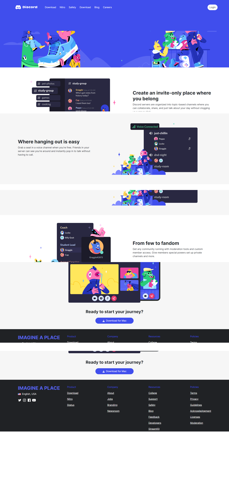

<h1 align="center">Discord Clone UI</h1>

<div align="center">
  <h3>
    <a href="https://next-projects-omega.vercel.app/">
      Live App
    </a>
    <span> | </span>
    <a href="https://github.com/nkp1111/next-projects/tree/main/discord-clone-ui">
      GitHub
    </a>
  </h3>
</div>

## Table of Contents

- [Overview](#overview)
  - [Built With](#built-with)
- [How to use](#how-to-use)
- [Contact](#contact)
- [Acknowledgements](#acknowledgements)

## Overview



### Built With

- Next.js
- React.js
- Bootstrap

## How To Use

To clone and run this application, you'll need [Git](https://git-scm.com) and [Node.js](https://nodejs.org/en/download/) (which comes with [npm](http://npmjs.com)) installed on your computer. From your command line:

```bash
# Clone this repository
$ git clone https://github.com/nkp1111/next-projects.git

# Install dependencies
$ npm install

# Go to project directory
$ cd discord-clone-ui

# Run the app
$ npm run dev
# or
yarn dev
# or
pnpm dev

```

Open [localhost:3000](http://localhost:3000) with your browser to see the result.

## Acknowledgements

- react-icons

## Contact

- Neeraj Parmar
- GitHub [nkp1111](https://github.com/nkp1111)
- Twitter [@nkp11111507](https://twitter.com/@nkp11111507)
