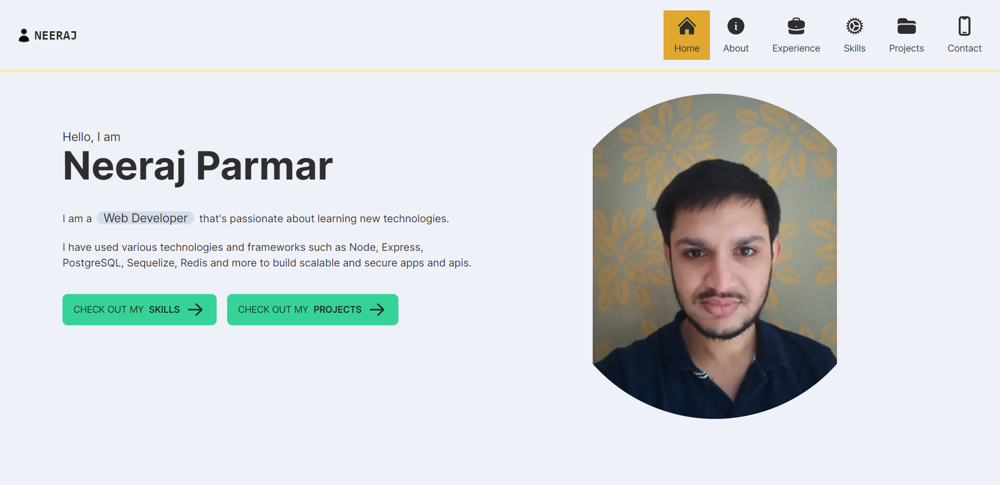

# Next-Portfolio

## Table of Contents

* [Links](#links)
* [Overview](#overview)
  * [Built With](#built-with)
* [Features](#features)
* [How to use](#how-to-use)
* [Contact](#contact)
* [Technologies](#technologies)

## Links

* [Live App](https://next-projects-puce.vercel.app/)
* [GitHub](https://github.com/nkp1111/next-projects/tree/main/next-portfolio)

## Overview



## Features

* Personal information about me
* Show my skills, projects, work experience and more

## Built With

* Next.js
* React.js
* Typescript
* TailwindCSS

## How To Use

To clone and run this application, you'll need [Git](https://git-scm.com) and [Node.js](https://nodejs.org/en/download/) (which comes with [npm](http://npmjs.com)) installed on your computer. From your command line:

```bash
# Clone this repository
$ git clone https://github.com/nkp1111/next-projects.git

# Go to project directory
$ cd next-portfolio

# Install dependencies
$ npm install

# Run the app
$ npm run dev

```

Open [localhost:3000](http://localhost:3000) with your browser to see the result.

## Technologies

* daisyui
* heroicons

## Contact

* Neeraj Parmar
* GitHub [nkp1111](https://github.com/nkp1111)
* LinkedIn [neeraj](https://www.linkedin.com/in/neeraj-parmar-058591244/)
* Twitter [@nkp11111507](https://twitter.com/@nkp11111507)
